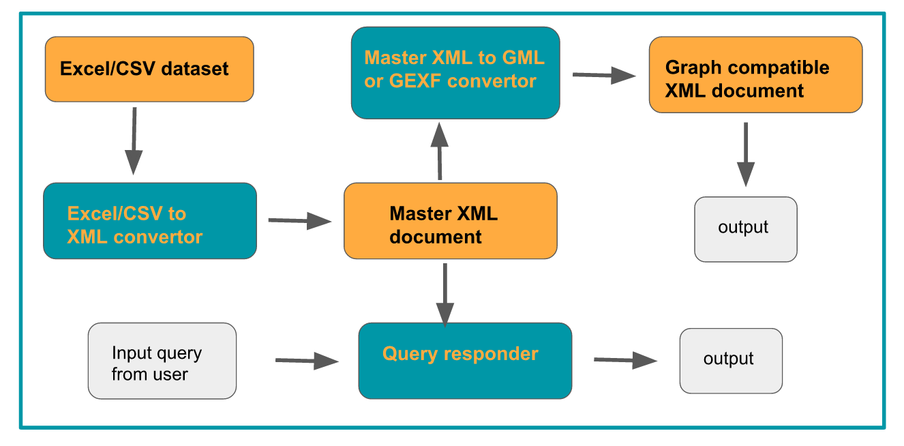
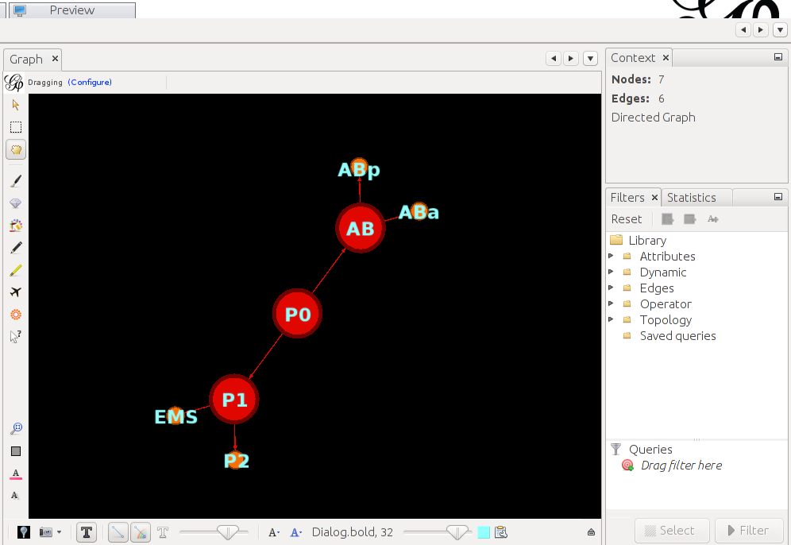
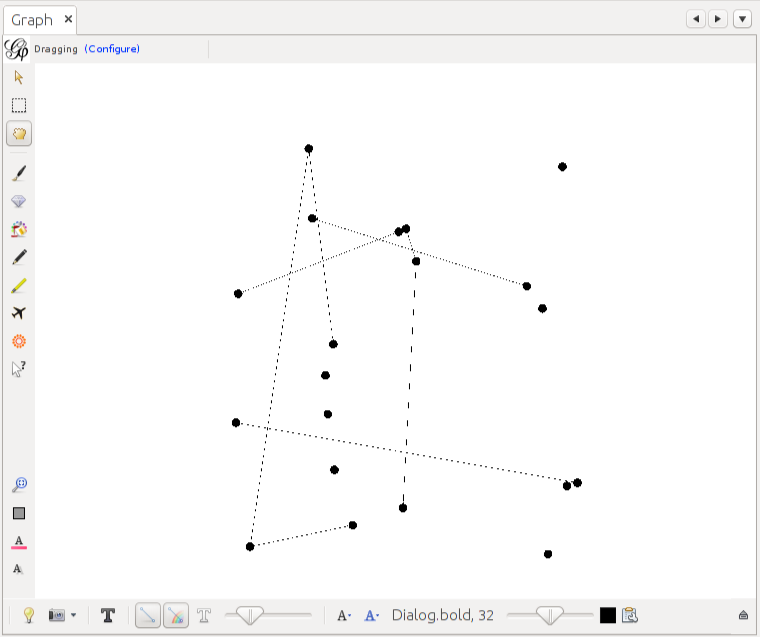
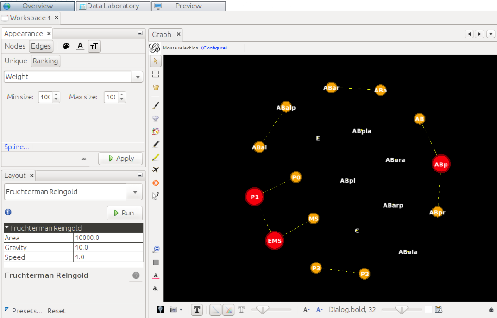

# GSOC-2018
Repository for Google Summer of Code Project - 2018

Parts of the project:-

  - The datasets
  - Query Responder on terminal(command line interface)
  - Excel/CSV to XML convertor
  - XML to compatible graphical format convertor
  - Research paper planning

**Force Atlas at 10^3 force units and linear splined node colour for first 3 generations**
**Precursor - P0 -> P1, AB**

1. The Datasets

   - The secondary datasets are available in excel spreadsheets format and can be [found here](https://github.com/arnab1896/GSOC-2018/tree/master/embryogenesis_datasets).
   - Firstly this needs to be converted to XML format as a first step in processing
   - Second step is to convert it into some compatible graphical XML schema that will be decided depending on the application being used

More details are given in [**"README.md"**](https://github.com/arnab1896/GSOC-2018/tree/issue-8_branch/embryogenesis_datasets) file of the folder along with a flow chart

2. Query Responder on terminal(command line interface)

   - The most basic functionality that will be provided is a command line interface for users to query about certain cells (precursor as well as adult and everything in between)
   - Users will be able to find answers to some basic queries like lineage name, parent and daughter cell information, description of adult cell if applicable.
   - Importantly, the interface will run in an endless loop and users will be able to cycle between generations through the options given after every query response is displayed on the screen

More details are given in [**"README.md"**](https://github.com/arnab1896/GSOC-2018/tree/issue-8_branch/python_query_respond) file of the folder along with a flow chart

3. Excel/CSV to XML convertor

   - Takes input in excel/CSV format and generates an XML document in a predecided schema

More details are given in [**"README.md"**](https://github.com/arnab1896/GSOC-2018/tree/issue-8_branch/python_xml_generator) file of the folder along with a flow chart

4. XML to compatible graphical format convertor

   - Takes input in XML format and generates an XML document in a graphical schema that is compatible with the simulation application being used - in this case, **GEPHI**.
   - The current code in this repository only supports *.gml creation. Plans are in the pipeline to add other formats like *.gexf too.
   - The *.gml file created depends on user's choice. Either the entire embryogenesis data is ported from XML/CSV to GML. Or only those cells that belong to a certain class of cells - like intestinal or pharyngeal or Amphid neurons, etc. are ported.

More details are given in [**"README.md"**](https://github.com/arnab1896/GSOC-2018/tree/issue-8_branch/python_graph_generator) file of the folder along with a flow chart

5. Research paper planning

   - This folder houses some rough ideas and a points that might be expanded onto later on in case a paper results from the efforts of this project.
   - Later on, these ideas might be researched in more depth or tested and in case it makes sense to go ahead with a paper, then these points will be useful
   - For more details, enter this [folder](https://github.com/arnab1896/GSOC-2018/tree/master/paper_planning).

**Initialized State of nodes at randomized positions**

**After applying Fruchterman Reingold at 10 units gravity and 10^3 units area**

For tutorials on Gephi, visit [website](https://gephi.org/)
