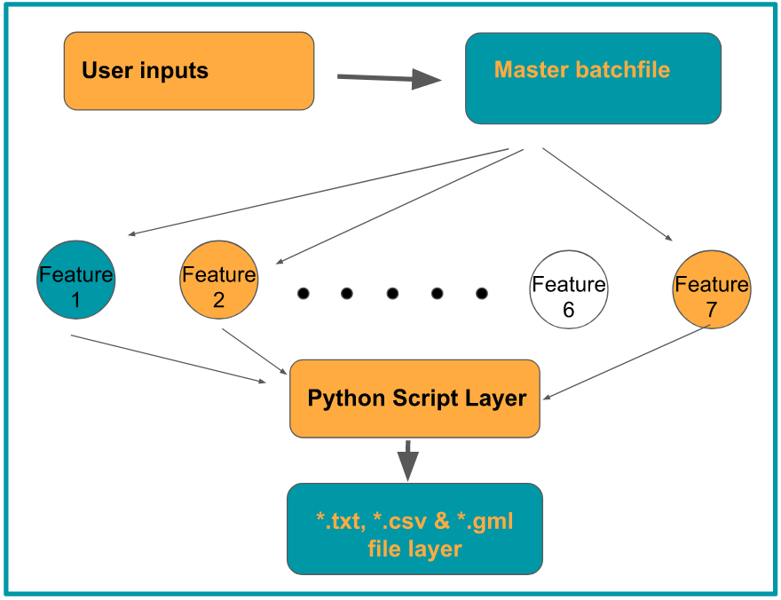
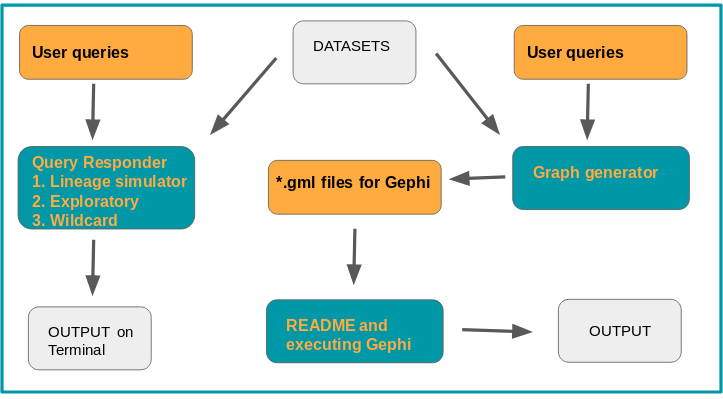
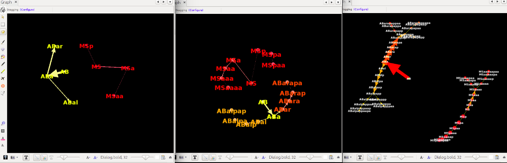

# GSOC-2018
Repository for Google Summer of Code Project - 2018

## Parts of the project:-

  - The datasets
  - Research paper planning
  - Gephi instructions and basics
  - Guides - for users and developers

**Main flowchart:**

**Modules completed till now or almost done:**

1. The Datasets

   - The secondary datasets are available in excel spreadsheets format and can be [found here](https://github.com/arnab1896/GSOC-2018/tree/master/embryogenesis_datasets).
   - For all features except for the one in which XML is being created, these datasets are used in *.csv format and this is used for subsequent processing
   - Second step is to convert it into some compatible graphical XML schema that will be decided depending on the application being used. Here, we mostly use *.gml because **GEPHI** is used for simulation.
   - For the XML feature, the datasets are directly read and converted into XML.

More details are given in [**"README.md"**](https://github.com/arnab1896/GSOC-2018/tree/issue-8_branch/embryogenesis_datasets) file of the folder along with a flow chart

2. Research paper planning

   - This folder houses some rough ideas and a points that might be expanded onto later on in case a paper results from the efforts of this project.
   - Later on, these ideas might be researched in more depth or tested and in case it makes sense to go ahead with a paper, then these points will be useful
   - For more details, enter this [folder](https://github.com/arnab1896/GSOC-2018/tree/master/paper_planning).

3. Gephi instructions and basics

   - Some common errors might be encountered while using Gephi. They have been addressed here.
   - Also, some suggestions for common settings and tutorials for gephi are placed here
   - For more details, enter this [folder](https://github.com/arnab1896/GSOC-2018/tree/master/gephi_initial_try).

4. Guides - for users and developers
   
   - Two guides have been written in the same [README.md file here](https://github.com/arnab1896/GSOC-2018/tree/master/guides).
   - They have a basic gist of what to expect from the project if you are a user and some contact information for developers who might want to contribute to the project

## The features and their explanation:-

  - Query Responder on terminal(command line interface)
  - XML Generator
  - Common path and trajectory analysis
  - Wildcard Query for lineage
  - Exploratory Search
  - CSV to compatible graphical format convertor
      i.  GML tree generator
      ii. GML cell group generator

1. Query Responder on terminal(command line interface)

   - The most basic functionality that will be provided is a command line interface for users to query about certain cells (precursor as well as adult and everything in between)
   - Users will be able to find answers to some basic queries like lineage name, parent and daughter cell information, description of adult cell if applicable.
   - Importantly, the interface will run in an endless loop and users will be able to cycle between generations through the options given after every query response is displayed on the screen

More details are given in [**"README.md"**](https://github.com/arnab1896/GSOC-2018/tree/issue-8_branch/python_query_respond) file of the folder along with a flow chart

2. XML generator

   - Takes input in excel/CSV format and generates an XML document in a predecided schema

More details are given in [**"README.md"**](https://github.com/arnab1896/GSOC-2018/tree/issue-8_branch/python_xml_generator) file of the folder along with a flow chart

3. Common path & trajectory analysis

   - This folder houses a simple code that takes input in the form of 2 or more specific cells.
   - The output of this cell is in the form of a last common ancestor that these cells had.

More details are given in [**"README.md"**](https://github.com/arnab1896/GSOC-2018/tree/issue-8_branch/python_common_path) file of the folder along with a flow chart

4. Wildcard Query for lineage

   - A search key will be given by user. All lineages corresponding to that key/organ will be returned as a result
   - Example. "spike" will result in both adult spike cells being given in output

More details are given in [**"README.md"**](https://github.com/arnab1896/GSOC-2018/tree/issue-8_branch/python_query_respond) file of the folder along with a flow chart

5. Exploratory Search

   - A search key will be given by user. All lineages containing that as a subset will be outputted
   - Example. "Cpppp" will result in all the following cells being outputted in details : **Cpppp**, **Cppppa** and **Cppppp**

More details are given in [**"README.md"**](https://github.com/arnab1896/GSOC-2018/tree/issue-8_branch/python_query_respond/explore) file of the folder along with a flow chart

**A very important point to note is that what differentiates feature 4 and 5 is this :-**

| Feature 4 - Wildcard Search | Feature 5 - Exploratory Search |
|:-------------------------------------------------------:|:--------------------------------------------------------------------------:|
| Meant for adult cells | Meant for cells that are in between precursor and end cells |
| Will only return results on perfect match of search key | Will return results of all lineages that match (even supersets) of the key |

6. CSV to compatible graphical format convertor

   - This feature has two main sub-features
   - The first one deals with simply creating a tree-like network of nodes for 3 subsequent generations starting from a specific node as the master ancestor node. Currently, only the precursor cell P0 is considered as master ancestor. Work is process to give users flexibility to take any node as master ancestor and create tree from there on as initial point.
   - The second feature is exciting. It will create gml files depending on the lineages. Where do these lineages come from? Well, to begin with, the user selects a super-class of cells that need to be analyzed over successive generations. There are 3 snapshots taken of these cells over their entire lifetime to create 3 gml files with a spaced time period.
   - When simulated in Gephi, it gives a good idea of the over-a-time-period development of these cells that belong to the same class
   - The *.gml file created depends on user's choice. Either the entire embryogenesis data is ported from XML/CSV to GML. Or only those cells that belong to a certain class of cells - like intestinal or pharyngeal or Amphid neurons, etc. are ported.

More details are given in [**"README.md"**](https://github.com/arnab1896/GSOC-2018/tree/issue-8_branch/python_graph_generator) file of the folder along with a flow chart

##**Some sample simulation pictures from Gephi**

**Pharyngeal Cell Cluster**
**Development cycle from phase 2 to phase 1 to phase 0[ADULT STATE]**

**Force Atlas at 10^3 force units and linear splined node colour for first 3 generations**
**Precursor - P0 -> P1, AB**

**Initialized State of nodes at randomized positions**

**After applying Fruchterman Reingold at 10 units gravity and 10^3 units area**

For tutorials on Gephi, visit [website](https://gephi.org/)
