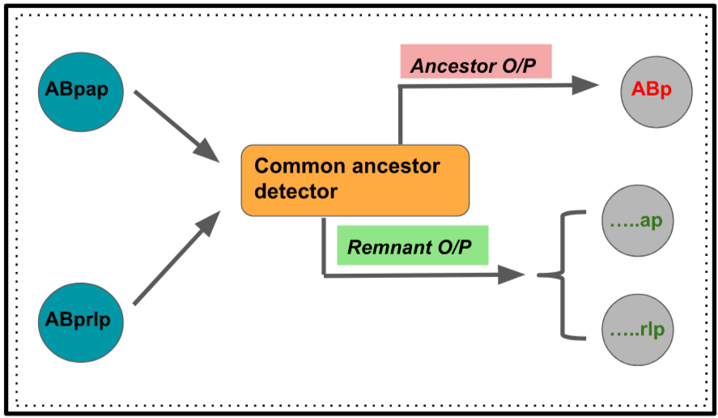

# GSOC-2018
Repository for Google Summer of Code Project - 2018

Parts of this module:-

  - First lineage inputted by user
  - Second lineage inputted by user
  - Common ancestor detector

-> Common ancestor detector

   - This first finds out if at all there is a common ancestor between given two lineages
   - If NO, outputs finding
   - If YES, generates the above mentioned ancestor and future trajectories of respective cells

__
# Example

INPUT:
   - Lineage 1 - **AB alpppppaa** (Amphid neuron, prob. chemosensory)
   - Lineage 2 - **AB alppaaapa** (Ventral cord interneuron, synapses onto motor neurons)

OUTPUT:
   - Common ancestor -      **AB alpp**
   - Remnant trajectory 1 - **....pppaa**
   - Remnant trajectory 2 - **....aaapa**
