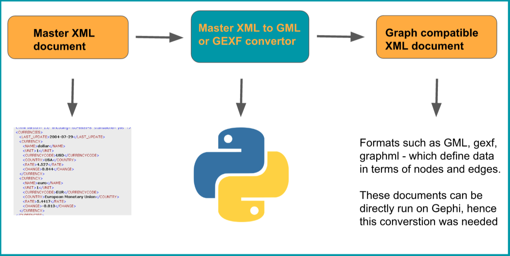
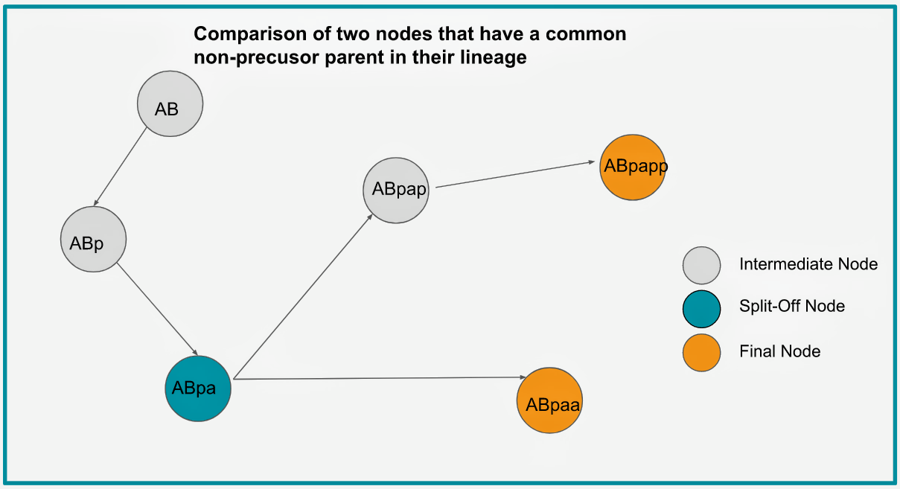

# GSOC-2018
Repository for Google Summer of Code Project - 2018

Parts of this module:-

  - Master XML document
  - Convertor
  - Output XML docs in graphically compatible format

-> XML to compatible graphical format convertor

   - Takes input in XML format and generates an XML document in a graphical schema that is compatible with the simulation application being used - in this case, **GEPHI**.
   - As can be seen in flow chart above, the convertor in the middle has been written in python.

__
# Cell group analyser

Lets say a user specifically wants to analyse only a certain group of cells. In that case, there is no point in generating a *.gml or *.gexf file that has all the cells because it will over-densify the graph simulated in Gephi.

For example, if user only wants to analyse the Amphid Neurons, then the following cells only will be filtered out and converted to a *.gml file :

   - ADFL - **AB alpppppaa** (Amphid neuron, prob. chemosensory)
   - ADFR = **AB praaappaa** (Amphid neuron, prob. chemosensory)
   - ADLL - **AB alppppaad** (Amphid neuron, prob. chemosensory)
   - ADLR - **AB praaapaad** (Amphid neuron, prob. chemosensory)

Here, we should make note that some cells have a totally independant lineage starting from the precursor (P0,AB,P1, etc.) right up the way to the final adult cell node.

However, some final adult cells have a n'th degree common parent ancestor cell. A hypothetical example has been shown in the below picture

So, for these cells care must be taken to not repeat the node names in the *.gml or *.gexf file. That is why, we need a script that will specifically have the following step by step task:

1. Understand which group of cells user wants to analyse.
2. Query the *.csv file to capture only those cells that belong to that chosen category.
3. Print/write the lineage names of all the cells identified in step 2 in a text file
4. Have another script that will capture these lineage names from text file generated in step 3 and nodify them. Nodify is the process of splitting the lineage into succesive generations of nodes.
5. Filter out the redundant nodes that need not be simulated more than once.
