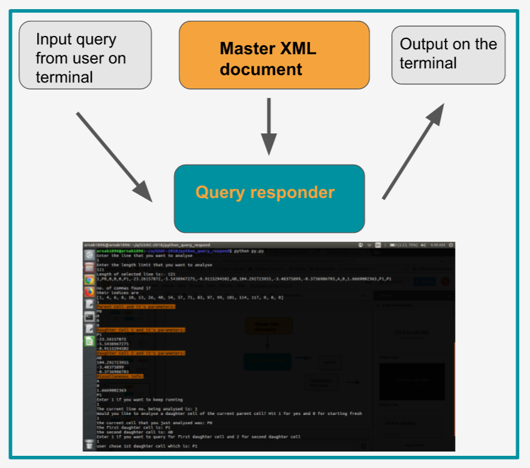

# GSOC-2018
Repository for Google Summer of Code Project - 2018

Parts of the project:-

  - Input query that will be typed by user
  - The terminal(command line interface) for displaying output
  - The master XML document

2. Query Responder on terminal(command line interface)

   - The most basic functionality that will be provided is a command line interface for users to query about certain cells (precursor as well as adult and everything in between)
   - Users will be able to find answers to some basic queries like lineage name, parent and daughter cell information, description of adult cell if applicable.
   - Importantly, the interface will run in an endless loop and users will be able to cycle between generations through the options given after every query response is displayed on the screen
   - For example, if user begins by querying for precursor P0; these steps will happen:
      i. Output will be displayed on terminal with important parameters of P0
      ii. Following this, user will be given option of continuing with one of P0's daughter cells, that is, either P1 or AB, so on and so forth

##Explanation

As a user, you can query for cells and speccific parameters about them which include(but not limited to) daughter cell names, 'X' 'Y' 'Z' parameters, function of cell(in case of being in adult C.elegans)
