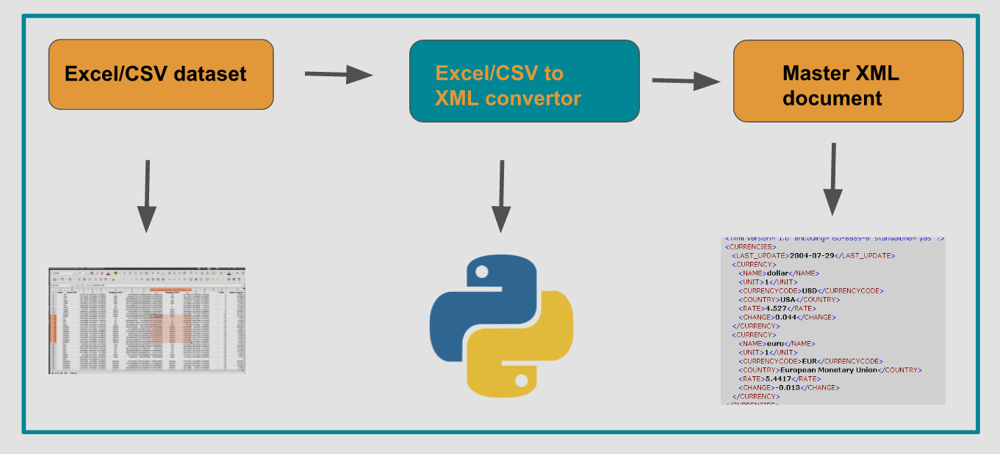

# GSOC-2018
Repository for Google Summer of Code Project - 2018

Parts of the project:-

  - The origin datasets in excel or CSV format
  - The convertor written in python
  - Master XML document that is generated as output

3. Excel/CSV to XML convertor

   - Takes input in excel/CSV format and generates an XML document in a predecided schema
   - This XML document being created is very important because it is used further in the pipeline of the project for other modules like query-responder and graphical simulation
